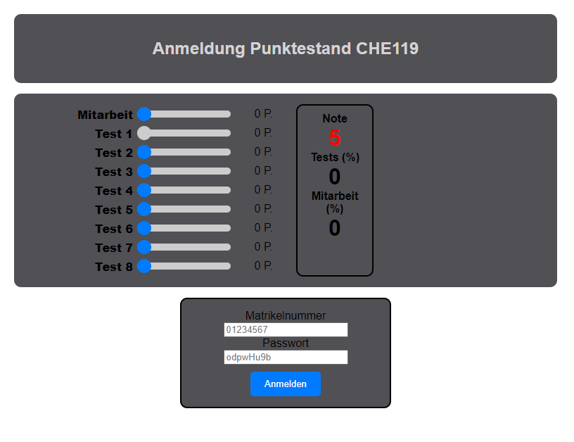

# Score Application Overview
The Score Application, deployed on [fungos.pythonanywhere.com](https://fungos.pythonanywhere.com), is designed to help university students track and manage their grades throughout their courses. This web-based application provides both students and administrators with a user-friendly interface to interact with course-related grades and exams.

*Voiced screencast for the Score Application – Users Perspective*

# Get Started
use the example user "1234" with password "1234" to experience the users perspective of this application.

# Features

## Student Login and Dashboard
- **Secure Login:** Students can log in securely using their credentials.
- **Personal Dashboard:** Upon logging in, students are directed to their personal dashboard where they can view their current points and grades for the course.

## Grade Tracking and Visualization
- **Score Summary:** The dashboard displays a summary of the student’s current scores across various exams.
- **Detailed Breakdown:** Students can see detailed breakdowns of their grades, helping them understand their performance better.

## Grading Tool
- **Simulate Final Grades:** A built-in grading tool allows students to simulate potential final grades.
- **Hypothetical Scores:** Students can input hypothetical scores for upcoming exams and assignments to see how these scores would affect their overall grade.
- **Goal Setting:** This tool helps students set realistic goals and understand what they need to achieve to attain their desired final grade.

## Admin Panel
- **Django Admin Panel:** The application includes a Django admin panel accessible only to admin users.
- **Efficient Management:** Admins can upload exams and assignments, and manage the grading process efficiently.
- **Grade Maintenance:** The admin panel supports easy maintenance of student grades, allowing updates and adjustments as needed without extensive manual effort.

## Exam Management
- **Upload Exam Details:** Admins can upload exam details and results directly through the admin panel.
- **Access to Results:** Students can then access their graded exams through their dashboard, providing transparency and immediate feedback.

## User-Friendly Interface
- **Intuitive Design:** The application is designed to be intuitive and easy to navigate, ensuring that both students and admins can use it without extensive training.
- **Simplified Process:** The layout and features are aimed at simplifying the grade tracking process, making academic performance monitoring straightforward.

## Mobile Compatibility
- **Optimized for Devices:** The application is optimized for both mobile and desktop devices by adapting its style for smaller screens.

# Student Experience

- **Login:** Students use their provided credentials to log into the application.
- **Dashboard:** After logging in, students are presented with a dashboard summarizing their current grades.
- **Grade Simulation:** Using the grading tool, students can input hypothetical scores to explore different grading scenarios.

# Admin Experience

- **Login:** Admin users log in through a secure admin portal.
- **Manage Grades:** Using the Django admin panel, admins can upload exam results and update grades.
- **Exam Upload:** Admins can upload new exams and related data, making it available to students immediately.
- **Maintain Records:** The admin panel allows for easy maintenance and adjustment of student grades, ensuring accuracy and transparency.

# Benefits

## For Students:
- Provides a clear overview of academic performance.
- Helps in setting realistic academic goals.
- Offers transparency in grading, fostering trust and understanding.

## For Admins:
- Simplifies the process of managing student grades.
- Reduces the effort required to maintain accurate and up-to-date grading records.
- Enhances communication with students regarding their academic progress.

# Conclusion

The Score Application is an essential tool for both students and administrators in a university setting. By providing a platform to track, manage, and simulate grades, it ensures that students are well-informed about their academic progress and can make informed decisions to achieve their academic goals. The integration with Django’s powerful admin panel further enhances the ease of managing grades, making it a valuable resource for educational institutions.
